CodeMR Report for Apache Kafka
=================
See our [web site](https://www.codemr.co.uk) for details on the CodeMR.

### Snapshots ###

#### Overview #### 
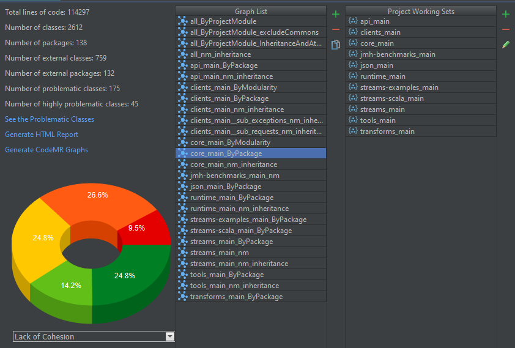

#### All Kafka modules (except the common module) #### 
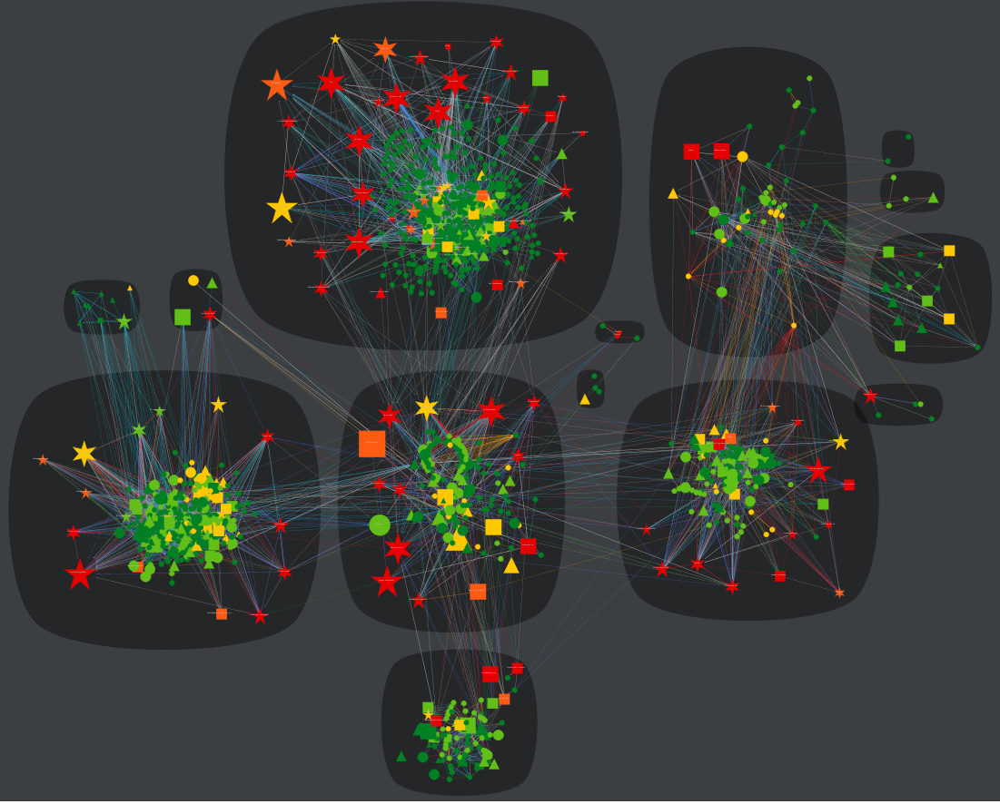

#### All Kafka modules with inheritance and attribute relation#### 
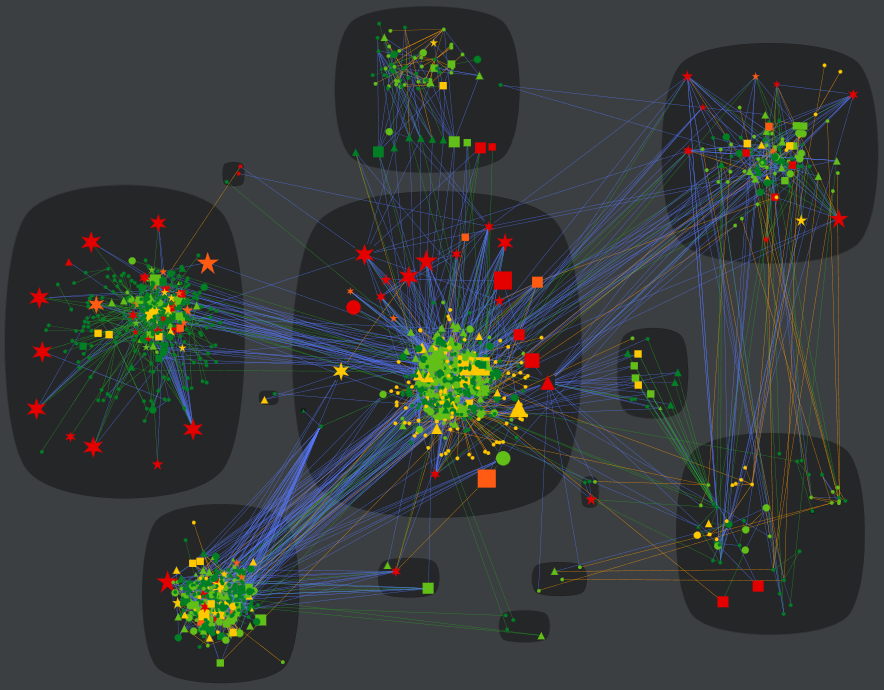

#### API Module #### 
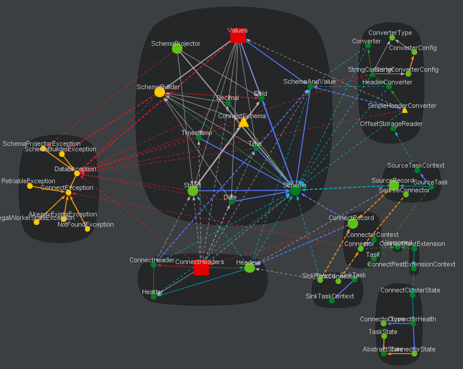

#### APIModuleInheritance #### 
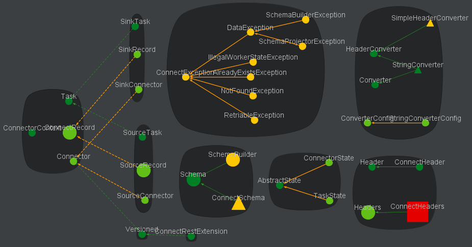

#### Core Module #### 
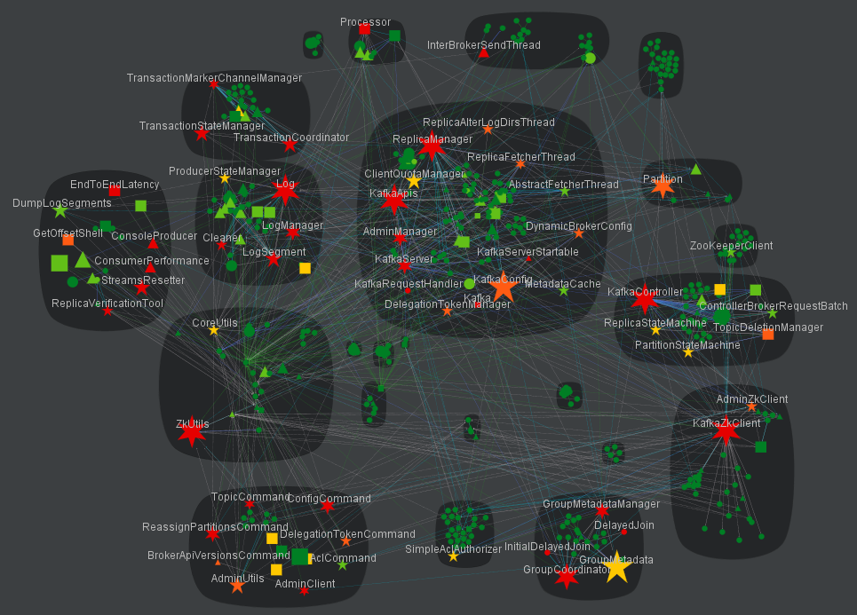

#### CoreInheritance #### 
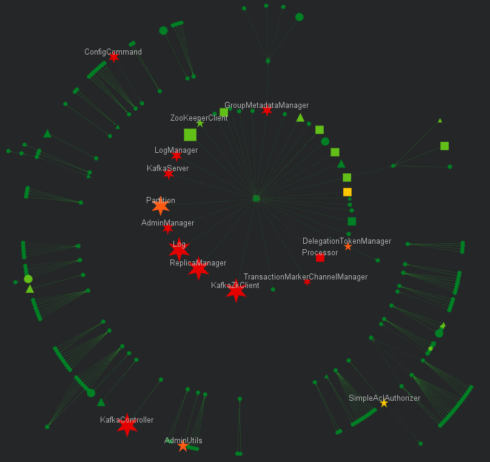

#### CoreModuleComplexityTreeMap #### 
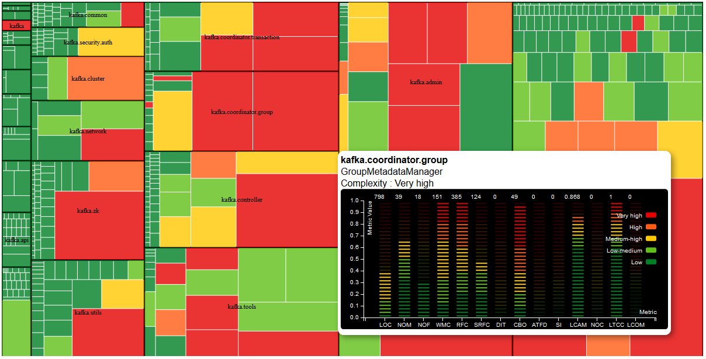

#### PackageStructure-Coupling #### 
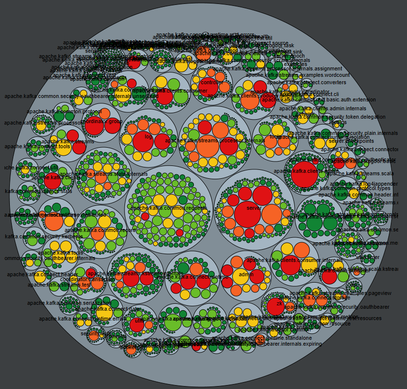

#### RuntimeModule #### 
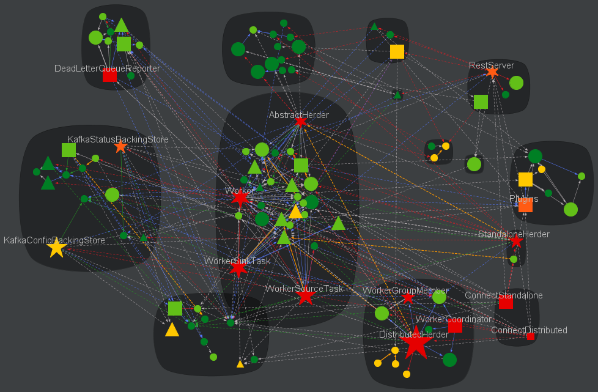

#### RuntimeModuleComplexitySunburst #### 
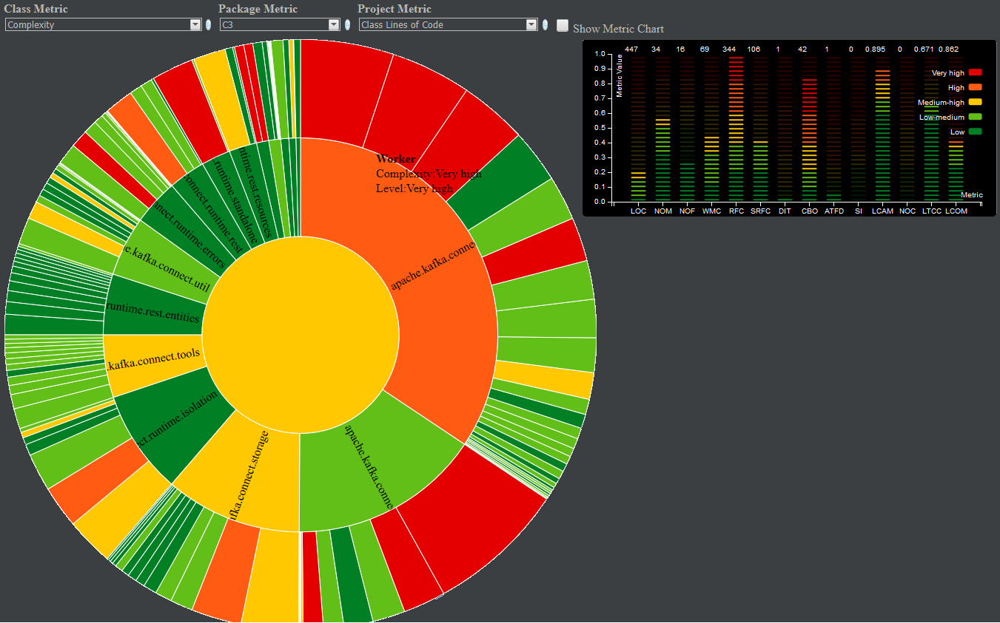

#### ToolsModule #### 
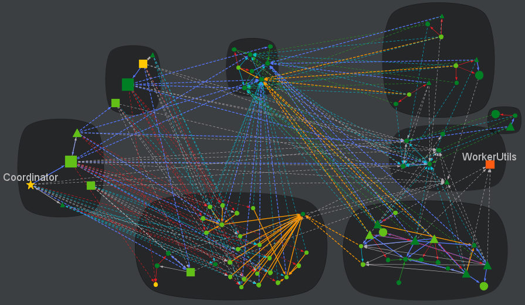

#### ToolsModuleInheritance #### 

