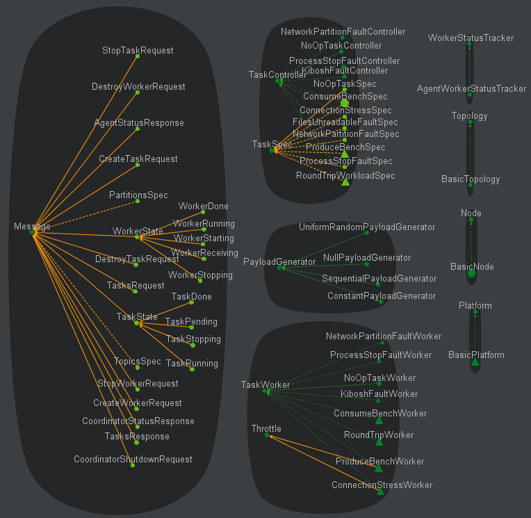

CodeMR Report for Apache Kafka
=================
See our [web site](https://www.codemr.co.uk) for details on the CodeMR.

### Snapshots ###

#### Overview #### 

#### All Kafka modules (except the common module) #### 

#### All Kafka modules with inheritance and attribute relation#### 

#### API Module #### 

#### APIModuleInheritance #### 

#### Core Module #### 

#### CoreInheritance #### 

#### CoreModuleComplexityTreeMap #### 

#### PackageStructure-Coupling #### 

#### RuntimeModule #### 

#### RuntimeModuleComplexitySunburst #### 

#### ToolsModule #### 

#### ToolsModuleInheritance #### 

